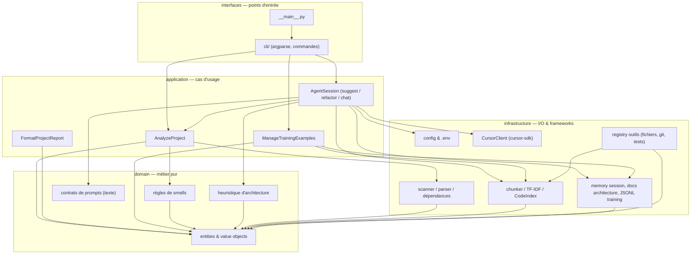
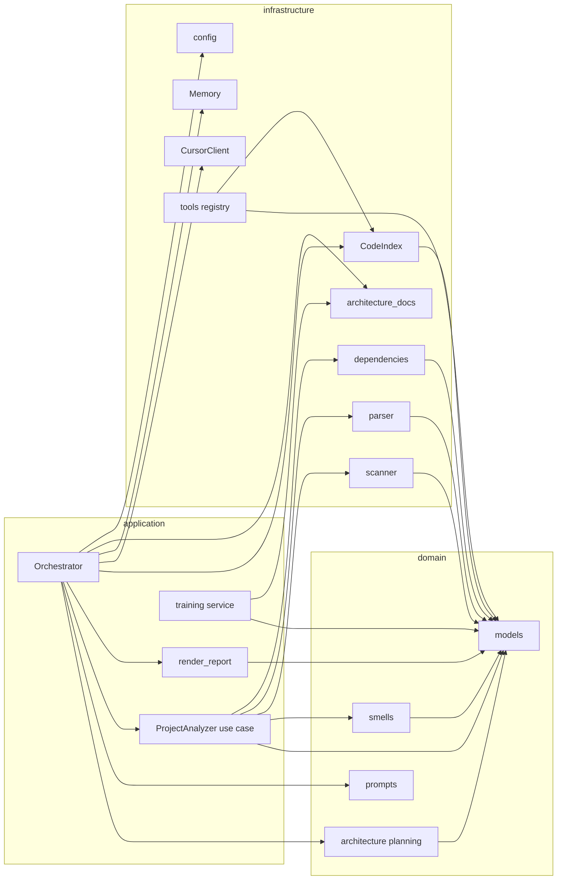

# Modélisation — clean-ia (architecture en couches)

Vue cible pour le package `clean_ia` sous `src/clean_ia/`. Les flèches indiquent la direction des dépendances autorisées (du haut vers le bas).

## Correspondance actuelle → cible

| Emplacement actuel | Couche cible | Rôle |
| --- | --- | --- |
| `models.py` | `domain/models/` | Entités : `ProjectReport`, `ParsedFile`, `Smell`, `AgentResult`, etc. |
| `analyzer/smells.py` | `domain/analysis/smells.py` | Seuils et détection de smells (sans I/O). |
| `orchestrator/heuristic.py` | `domain/architecture/planning.py` | Plan en couches à partir d'un `ProjectReport`. |
| `orchestrator/prompts.py` | `domain/agent/prompts.py` | Textes système / utilisateur (pas d'appel réseau). |
| `analyzer/service.py` (`ProjectAnalyzer`, `render_report`) | `application/analyze.py` + `application/report.py` | Cas d'usage « analyser » et formatage texte du rapport. |
| `orchestrator/agent.py` | `application/agent_session.py` | Orchestration suggest / refactor / chat. |
| `training/dataset.py` (logique métier) | `application/training.py` | Charger / ajouter / sélectionner des exemples. |
| `analyzer/scanner.py`, `parser.py`, `dependencies.py` | `infrastructure/analysis/` | Lecture disque, AST, graphe d'imports. |
| `config.py` | `infrastructure/config/` | Variables d'environnement et `Settings`. |
| `index/*` | `infrastructure/index/` | Découpage et recherche TF-IDF. |
| `llm/cursor.py` | `infrastructure/llm/cursor.py` | Adaptateur `cursor-sdk`. |
| `orchestrator/memory.py`, `architecture_docs.py` | `infrastructure/persistence/` | Session JSON, écriture `architecture/*.md`. |
| `tools/registry.py` | `infrastructure/tools/` | Fichiers, subprocess tests, git. |
| `cli/main.py`, `__main__.py` | `interfaces/cli/` | Parsing CLI mince + dispatch vers l'application. |

## Modules internes (détail)

## Couches (rappel)

- **domain** : `src/clean_ia/domain/` — modèles, règles smells, heuristique d'architecture, prompts.
- **application** : `src/clean_ia/application/` — analyser un projet, formater un rapport, session agent, gestion des exemples d'entraînement.
- **infrastructure** : `src/clean_ia/infrastructure/` — disque, AST, index, API Cursor, cache, outils fichiers/git/tests.
- **interfaces** : `src/clean_ia/interfaces/cli/` — `clean-ia` (entry point `pyproject.toml` inchangé en nom, chemin Python mis à jour).
